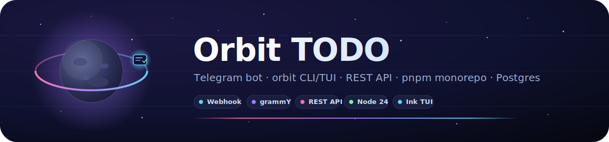

<p align="center">
  
</p>

<p align="center">
  
  
  
  
  
</p>

# Orbit TODO Bot 🪐

Telegram TODO bot for personal use (Kostya + Dasha).

## Features

- Create tasks for yourself or another user
- Lists with inline buttons (Done/Reopen/Assign/Edit/Delete)
- PostgreSQL storage (via Prisma)

## Local run (dev)

1) Create `.env` from `.env.example`
2) Start services:

```bash
docker compose up -d
```

## Notes

- `.env` is intentionally not committed.
- Database data is stored in a Docker volume (`todo_pg`).
